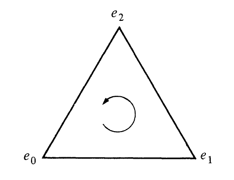
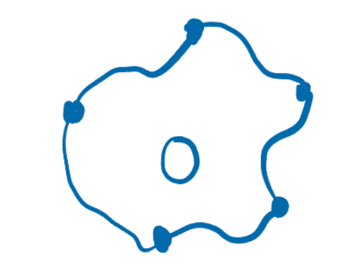
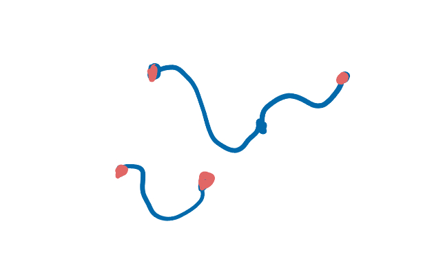
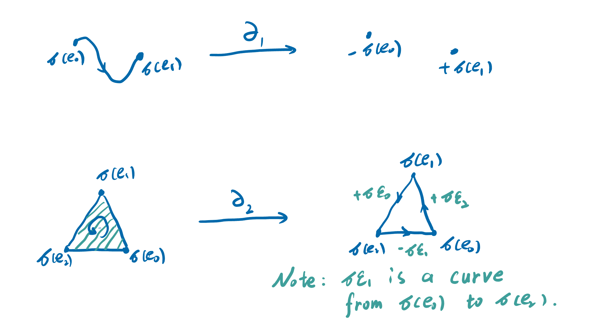
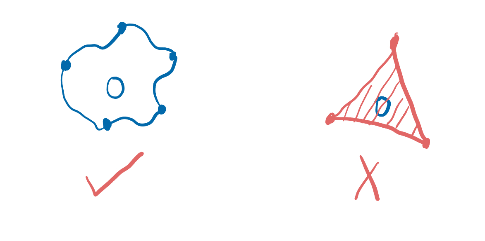
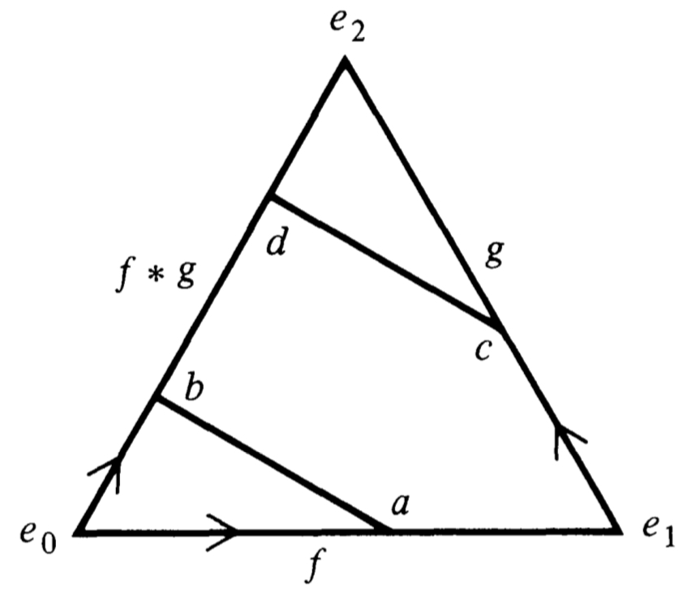
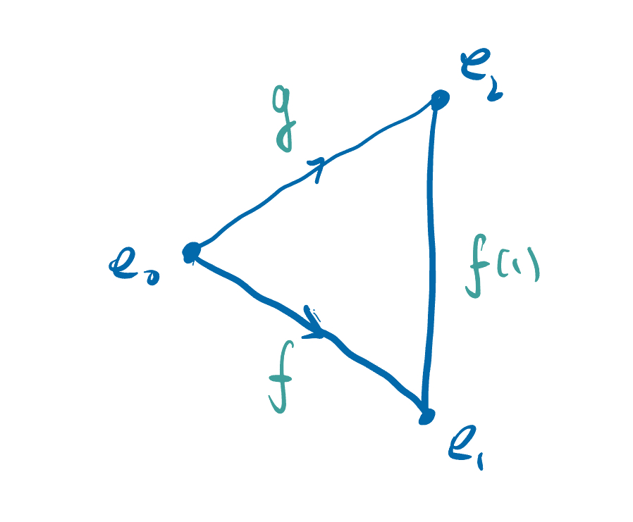
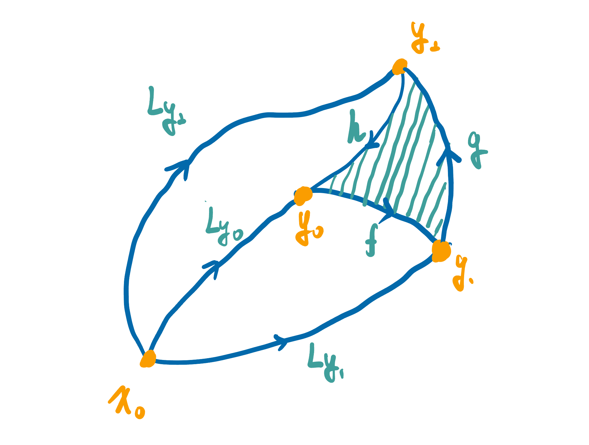

# Singular Homology

This document is a seminar note on singular homology.

Before reading this article, make sure you have known the Chapter 1-3 of *An Introduction to Algebraic Topology*, written by Rotman.

**Reference**

* *An Introduction to Algebraic Topology*, Rotman
* *Topology and Geometry*, Bredon 
* *代数学方法 卷一：基础架构*, 李文威
* [nlab](https://ncatlab.org/)

**Why should we learn homology?**

When we use calculus to solve physical problems, we often encounter functions like
$$
E(x,y,z)=\frac{kQ}{(x^2+y^2+z^2)^{3/2}}(x,y,z),
$$
where $k,Q$ are constants.

It can be noticed that $(0,0,0)$ is a singularity of it, and when integrating this function, we always choose an integration path or integration surface that bypasses the singularity. Moreover, from Maxwell's equations (or Stokes' theorem), we know that if we choose a closed surface in space for integration, the value of the integration only relates to the singularities inside. Here, the singularities can be considered as holes in the space defined by the function. This is why we are interested in the holes in space and consequently study their properties.

Homology was initially defined as closed curves or surfaces with the same integral values, but this definition cannot adapt to general topological spaces. From a geometric intuition, a hole should be a type of topological invariant that remains unchanged under homeomorphism. Therefore, we need to find some new methods to define homology, and thereby study the properties of these holes. Next, we will begin to learn a definition method of homology, which is the singular homology.

## 1. Definition of Singular Homology

Let's begin with some basic definitions.

> **1.1 Definition.**
>
> Let $A$ be a set and $F=\{f:A\to \mathbb Z;f^{-1}(\mathbb Z-\{0\}) \text{ is finite}\}$. 
>
> We can define a binary operation 
>
> $$
> \begin{align}
> +:F\times F&\to F,\\
> (f_1,f_2)&\mapsto[a\mapsto f_1(a)+f_2(a)].
> \end{align}
> $$
> It's easy to check that $(F,+)$ is an abelian group. And we call it the **free abelian group** on $A$​​.
>
> We usually denote $f\in F$ as $\sum_{a\in A} f(a)a$. 
>
> For example, we can use $2a_1-a_2$ to denote $f:A\to \mathbb Z,a\mapsto\begin{cases}2,&a=a_1,\\-1,&a=a_2,\\0,&a\ne a_1,a_2.\end{cases}$
>
> We also use $\mathbb Z^{\oplus A}$ to denote the free abelian group on $A$.

The free abelian group has a universal property.

> **1.2 Theorem (Universal Property).**
>
> Let $A$ be a set and $F$ be the free abelian group on it.
>
> $G$ is an abelian group and there is a function $f:A\to G$. Then there exists a unique group homomorphism $\sigma:F\to G$ making diagram
> $$
> \xymatrix{
> A \ar@{->}[r]^{i} \ar@{->}[rd]_{f} & F \ar@{-->}[d]^{\exists !\sigma} \\
>  & G
> }
> $$
> commute, where $i$​ is the inclusion. And $\sigma$ is called **extending by linearity**.
>
> **Proof.**
>
> Define $\sigma:F\to G,\sum_i c_ia_i\mapsto \sum_i c_if(a_i)$. It's easy to check that $\sigma$​ is a group homomorphism.
>
> Then let's prove $\sigma$ is unique.
>
> Let $\sigma_0$ is another function fit the theorem. Then we have 
> $$
> \begin{align}
> \sigma_0(\sum_i c_ia_i)&=\sum_ic_i\sigma_0(a_i)\\
> &=\sum_ic_if(a_i)\\
> &=\sigma(\sum_i c_ia_i).
> \end{align}
> $$
> Therefore, $\sigma_0=\sigma$ and $\sigma$ is unique. $\square$​

> **1.3 Definition.**
>
> For $n\in \mathbb N$, the **standard $n$​-simplex** is 
> $$
> \Delta^n:=\Set{(t_0,t_1,\dots,t_n)\in\mathbb R^{n+1};t_i\ge0,\forall i\text{ and }\sum_{j=0}^{n} t_j=1}.
> $$
> We can see their graphs in this picture: 
>
> 
>
> We can denote $\Delta^n$ as $[e_0,e_1,\dots,e_n]$, where $e_0,e_1,\dots,e_n$ are vertices of $\Delta^n$​.
>
> Sometimes, we will see $\Delta^1$ as $I$ with $(1-t,t)\mapsto t$.

When we perform integrations on some geometric shapes, these shapes often have an orientation. Similarly, we can also define an orientation for simplices.

> **1.4 Definition.**
>
> An **orientation** of $\Delta^n=[e_0,e_1,\dots,e_n]$ is a linear ordering of its vertices.
>
> An orientation thus gives a tour of the vertices. For example, the orientation $e_0<e_1<e_2$ of $\Delta^2$ gives a  counterclockwise tour.
>
> 
>
> Two orientations of $\Delta^n$ are the **same** if, as permutations of $\{e_0,e_1,\dots,e_n\}$, they have the same parity (i.e., both are even or both are odd); otherwise the orientations are **opposite**.

> **1.5 Definition.**
>
> Let $X$ be a topological space, $n\ge 0$. A **(singular) $n$-simplex** in $X$ is a continuous function $f:\Delta^n\to X$.
>
> $S_n(X)$ denotes the free abelian group generated by all singular $n$-simplices in $X$​; and we define $S_m(X)=0$ for all integers $m<0$.
>
> And we call an element in $S_n(X)$ is an **$n$-chain** on $X$.

Let's consider what the elements in $S_n(X)$ are.

Let $\sum_i m_i\sigma_i$ be an $n$-chain, where $m_i\in \mathbb Z$ and $\sigma_i:\Delta^n\to X$ is continuous. We can regard $\sigma_i$ as a $n$-dimensional geometric shape on $X$ (this may not be accurate), and the sign of $m_i$ denote the orientation of $\gamma_i$. Then we can consider $\sum_i m_i\sigma_i$ as a combination of some $n$-dimensional geometric shapes on $X$.

How to use $n$-chains to describe holes in $X$?

When X is a plane with some holes, we can notice that the holes in the plane can be surrounded by a 1-chain, whose simplices precisely form some "closed curves".

Therefore, we need a method to find "closed curves" and try to use them to describe holes.

As we can see, "closed curves" have no boundary while "open curves" always have at least two points as its boundary.

Thus, we need to describe the boundary of an $n$​-chain.

> **1.6 Definition.**
>
> Define the **$i$-th face map** of $\Delta^n$
> $$
> \begin{align}
> \varepsilon_i=\varepsilon_i^n:\Delta^{n-1}&\to\Delta^n,\\
> (t_0,\dots,t_{n-1})&\mapsto(t_0,\dots,t_{i-1},0,t_i,\dots,t_{n-1}).
> \end{align}
> $$

We can consider that the usage of these maps is to take out the face opposite to the $i$-th vertex in the n-simplex. With these maps, we can define the boundary of $n$-chains.

> **1.7 Definition.**
>
> If $\sigma:\Delta^n\to X$ is continuous and $n>0$, then its **boundary** is
> $$
> \partial_n\sigma=\sum_{i=0}^{n}(-1)^i\sigma\varepsilon_i^n\in S_{n-1}(X);
> $$
> if $n=0$, define $\partial_0\sigma=0$​​.
>
> As shown in the following figure, defining the boundary in this way is consistent with our geometric intuition.
>
> 
>
> Then we extend $\partial_n$ by linearity, and hence we get a group homomorphism $\partial_n:S_n(X)\to S_{n-1}(X)$, for all $n\in \mathbb N$. The homomorphisms $\partial_n$​ are called **boundary operators**.
>
> Strictly speaking, we ought to write $\partial_n^X$ instead of $\partial_n$ since these homomorphisms do depend on $X$​​; however, this is rarely done.
>
> For each $X$, we have constructed a sequence of free abelia groups and homomorphisms
> $$
> % link : https://darknmt.github.io/res/xypic-editor/#eyJub2RlcyI6W3sicG9zaXRpb24iOlswLDBdLCJ2YWx1ZSI6IlxcY2RvdHMifSx7InBvc2l0aW9uIjpbMSwwXSwidmFsdWUiOiJTX24oWCkifSx7InBvc2l0aW9uIjpbMiwwXSwidmFsdWUiOiJTX3tuLTF9KFgpIn0seyJwb3NpdGlvbiI6WzMsMF0sInZhbHVlIjoiXFxjZG90cyJ9LHsicG9zaXRpb24iOls0LDBdLCJ2YWx1ZSI6IlNfMShYKSJ9LHsicG9zaXRpb24iOls1LDBdLCJ2YWx1ZSI6IlNfMChYKSJ9LHsicG9zaXRpb24iOls2LDBdLCJ2YWx1ZSI6IjAifV0sImVkZ2VzIjpbeyJmcm9tIjowLCJ0byI6MX0seyJmcm9tIjoxLCJ0byI6MiwidmFsdWUiOiJcXHBhcnRpYWxfbiJ9LHsiZnJvbSI6MiwidG8iOjN9LHsiZnJvbSI6MywidG8iOjR9LHsiZnJvbSI6NCwidG8iOjUsInZhbHVlIjoiXFxwYXJ0aWFsXzEifSx7ImZyb20iOjUsInRvIjo2LCJ2YWx1ZSI6IlxccGFydGlhbF8wIn1dfQ==
> \xymatrix{
> \cdots \ar@{->}[r] & S_n(X) \ar@{->}[r]^{\partial_n} & S_{n-1}(X) \ar@{->}[r] & \cdots \ar@{->}[r] & S_1(X) \ar@{->}[r]^{\partial_1} & S_0(X) \ar@{->}[r]^{\partial_0} & 0
> }
> $$
> , called the **singular complex** of $X$; it is denoted by $(S_*(X),\partial)$ or, more simply, by $S_*(X)$.

Then, we can find all "closed curves".

> **1.8 Definition.**
>
> The group of **(singular) $n$-cycles** in $X$, denoted by $Z_n(X)$, is $\ker \partial_n$.

Although we can find all "closed curves" in a plane $X$, we still can't describe holes in $X$. We can note that the holes in the plane can be surrounded by 1-chains, but cannot be covered by 2-chains.

Therefore, we know that there are some "closed curves", boundaries of $2$-chains, surrounding no holes!

> **1.9 Definition.**
>
> The group of **(singular) $n$-boundaries** in $X$, denoted by $B_n(X)$, is $\operatorname{im} \partial_{n+1}$.

Wait, are $n$-boundaries really $n$-cycles?

> **1.10 Lemma.**
>
> If $j<i$, the face maps satisfy
> $$
> \varepsilon_i^{n+1}\varepsilon_j^n=\varepsilon_j^{n+1}\varepsilon_{i-1}^n:\Delta^{n-1}\to\Delta^{n+1}.
> $$
> It's easy to prove by using the definition of $\varepsilon_i^n$.

>**1.11 Theorem.**
>
>For all $n$, we have $\partial_n\partial_{n+1}=0$; and thus $B_n(X)\subset Z_n(X)$.
>
>**Proof.**
>
>Since $S_{n+1}(X)$ is generated by all $(n+1)$-simplices $\sigma$, it suffices to show that $\partial\partial\sigma=0$ for each such $\sigma$.
>$$
>\begin{align}
>\partial\partial\sigma
>&=\partial(\sum_{i=0}^{n+1}(-1)^i\sigma\varepsilon_i)\\
>&=\sum_{i=0}^{n+1}(-1)^i\partial(\sigma\varepsilon_i)\\
>&=\sum_{i=0}^{n+1}(-1)^i\sum_{j=0}^n(-1)^j\sigma\varepsilon_i\varepsilon_j\\
>&=\sum_{i=0}^{n+1}\sum_{j=0}^n(-1)^{i+j}\sigma\varepsilon_i\varepsilon_j\\
>&=(\sum_{i=1}^{n+1}\sum_{0\le j< i}(-1)^{i+j}\sigma\varepsilon_i\varepsilon_j)+(\sum_{i=0}^{n}\sum_{i\le j\le n}(-1)^{i+j}\sigma\varepsilon_i\varepsilon_j)\\
>&=(\sum_{i=1}^{n+1}\sum_{0\le j< i}(-1)^{i+j}\sigma\varepsilon_j\varepsilon_{i-1})+(\sum_{i=0}^{n}\sum_{i\le j\le n}(-1)^{i+j}\sigma\varepsilon_i\varepsilon_j)\\
>&=(\sum_{i=0}^{n}\sum_{0\le j\le i}(-1)^{i+j+1}\sigma\varepsilon_j\varepsilon_{i})+(\sum_{i=0}^{n}\sum_{i\le j\le n}(-1)^{i+j}\sigma\varepsilon_i\varepsilon_j)\\
>&=(\sum_{j=0}^{n}\sum_{j\le i\le n}(-1)^{i+j+1}\sigma\varepsilon_j\varepsilon_{i})+(\sum_{i=0}^{n}\sum_{i\le j\le n}(-1)^{i+j}\sigma\varepsilon_i\varepsilon_j)\\
>&=0\ \square
>\end{align}
>$$

Eventually, we can describe holes by using the quotient group.

> **1.12 Definition.**
>
> For each $n$, the $n$-th **(singular) homology group** of a space $X$ is
> $$
> H_n(X)=\frac {Z_n(X)}{B_n(X)}=\frac {\ker\partial_n}{\operatorname{im}\partial_{n+1}}.
> $$
> The coset $z_n+B_n(X)$, where $z_n$ is an $n$-cycle, is called the **homology class** of $z_n$, and it is denoted by $\operatorname{cls} z_n$.

## 2. Functorialities of $S_*$ and $H_n$

When we view $S_*$ and $H_n$​ from the perspective of category theory, we can find that they are actually functors.

> **2.1 Definition.**
>
> A **(chain) complex** is a sequence of abelian groups and homomorphisms
> $$
> % link : https://darknmt.github.io/res/xypic-editor/#eyJub2RlcyI6W3sicG9zaXRpb24iOlswLDBdLCJ2YWx1ZSI6IlxcY2RvdHMifSx7InBvc2l0aW9uIjpbMSwwXSwidmFsdWUiOiJDX3tuKzF9In0seyJwb3NpdGlvbiI6WzIsMF0sInZhbHVlIjoiQ19uIn0seyJwb3NpdGlvbiI6WzMsMF0sInZhbHVlIjoiQ197bi0xfSJ9LHsicG9zaXRpb24iOls0LDBdLCJ2YWx1ZSI6IlxcY2RvdHMifV0sImVkZ2VzIjpbeyJmcm9tIjowLCJ0byI6MX0seyJmcm9tIjoxLCJ0byI6MiwidmFsdWUiOiJcXHBhcnRpYWxfe24rMX0ifSx7ImZyb20iOjIsInRvIjozLCJ2YWx1ZSI6IlxccGFydGlhbF9uIn0seyJmcm9tIjozLCJ0byI6NH1dfQ==
> \xymatrix{
> \cdots \ar@{->}[r] & C_{n+1} \ar@{->}[r]^{\partial_{n+1}} & C_n \ar@{->}[r]^{\partial_n} & C_{n-1} \ar@{->}[r] & \cdots
> }
> $$
> , where $n\in \mathbb Z$, such that $\partial_n\partial_{n+1}=0$ for each $n\in \mathbb Z$. The homomorphism $\partial_n$ is called the **differentiation** of **degree** $n$, and $C_n$ is called the **term** of **degree** $n$.
>
> The complex above is denoted by $(C_*,\partial)$ or, more simply, by $C_*$. 

> **2.2 Definition.**
>
> If $(C_*,\partial)$ and $(C'_*,\partial')$ are complexes, a **chain map** $f:(C_*,\partial)\to(C_*',\partial')$ is a sequence of homomorphisms $\{f_n:C_n\to C_n'\}$ such that the diagram
> $$
> % link : https://darknmt.github.io/res/xypic-editor/#eyJub2RlcyI6W3sicG9zaXRpb24iOlsxLDBdLCJ2YWx1ZSI6IkNfe24rMX0ifSx7InBvc2l0aW9uIjpbMiwwXSwidmFsdWUiOiJDX24ifSx7InBvc2l0aW9uIjpbMywwXSwidmFsdWUiOiJDX3tuLTF9In0seyJwb3NpdGlvbiI6WzEsMV0sInZhbHVlIjoiQ197bisxfScifSx7InBvc2l0aW9uIjpbMiwxXSwidmFsdWUiOiJDX3tufScifSx7InBvc2l0aW9uIjpbMywxXSwidmFsdWUiOiJDX3tuLTF9JyJ9LHsicG9zaXRpb24iOlswLDBdLCJ2YWx1ZSI6IlxcY2RvdHMifSx7InBvc2l0aW9uIjpbNCwwXSwidmFsdWUiOiJcXGNkb3RzIn0seyJwb3NpdGlvbiI6WzQsMV0sInZhbHVlIjoiXFxjZG90cyJ9LHsicG9zaXRpb24iOlswLDFdLCJ2YWx1ZSI6IlxcY2RvdHMifV0sImVkZ2VzIjpbeyJmcm9tIjo2LCJ0byI6MH0seyJmcm9tIjoyLCJ0byI6N30seyJmcm9tIjowLCJ0byI6MSwidmFsdWUiOiJcXHBhcnRpYWxfe24rMX0ifSx7ImZyb20iOjEsInRvIjoyLCJ2YWx1ZSI6IlxccGFydGlhbF9uIn0seyJmcm9tIjozLCJ0byI6NCwidmFsdWUiOiJcXHBhcnRpYWxfe24rMX0nIiwibGFiZWxQb3NpdGlvbiI6InJpZ2h0In0seyJmcm9tIjo0LCJ0byI6NSwidmFsdWUiOiJcXHBhcnRpYWxfbiciLCJsYWJlbFBvc2l0aW9uIjoicmlnaHQifSx7ImZyb20iOjUsInRvIjo4fSx7ImZyb20iOjksInRvIjozfSx7ImZyb20iOjAsInRvIjozLCJ2YWx1ZSI6ImZfe24rMX0ifSx7ImZyb20iOjEsInRvIjo0LCJ2YWx1ZSI6ImZfbiJ9LHsiZnJvbSI6MiwidG8iOjUsInZhbHVlIjoiZl97bi0xfSJ9XX0=
> \xymatrix{
> \cdots \ar@{->}[r] & C_{n+1} \ar@{->}[r]^{\partial_{n+1}} \ar@{->}[d]^{f_{n+1}} & C_n \ar@{->}[r]^{\partial_n} \ar@{->}[d]^{f_n} & C_{n-1} \ar@{->}[r] \ar@{->}[d]^{f_{n-1}} & \cdots \\
> \cdots \ar@{->}[r] & C_{n+1}' \ar@{->}[r]_{\partial_{n+1}'} & C_{n}' \ar@{->}[r]_{\partial_n'} & C_{n-1}' \ar@{->}[r] & \cdots
> }
> $$
> commutes.

> **2.3 Theorem.**
>
> All complexes and chain maps form a category, denoted by $\mathbf{Comp}$, when one defines composition of chain maps coordinatewise: $\{g_n\}\circ\{f_n\}:=\{g_n\circ f_n\}$.
>
> It's easy to prove this is a category.

> **2.4 Theorem.**
>
> Let $f:X\to Y$ be a continuous function and $\sum_im_i\sigma_i\in S_n(X)$, where $m_i\in \mathbb Z$ and $\sigma_i$ is an $n$-simplex for all $i$. Define $f_\#(\sum_im_i\sigma_i)=\sum_i m_if\circ\sigma_i\in S_n(Y)$, and then we get a sequence of homomorphisms $\{f_\#:S_n(X)\to S_n(Y)\}$. (Note: $f_\#$ does depend on $n$, but we usually don't give it a subscript.)
>
> Define $S_*(f):=f_\#$. And then $S_n:\mathbf{Top}\to \mathbf{Ab},S_*:\mathbf{Top}\to \mathbf{Comp}$ are functors.
>
> **Proof.**
>
> Let $f:X\to Y$ and $g:Y\to Z$ are continuous functions. Then, for any $n$-simplex $\sigma$ in $X$, we have
> $$
> \begin{align}
> (f\circ g)_\#(\sigma)&=f\circ g\circ\sigma\\
> &=f_\#(g\circ \sigma)\\
> &=f_\#\circ g_\#(\sigma).
> \end{align}
> $$
> By the universal property of free abelian groups, we have $(f\circ g)_\#=f_\#\circ g_\#$.
>
> Let $1_X$ be the identity map of $X$. Then, for any $n$-simplex $\sigma$ in $X$, we have
> $$
> (1_X)_\#(\sigma)=1_X\circ\sigma=\sigma
> $$
> Similarly, because of the universal property of free abelian groups, we have $(1_X)_\#=1_{S_n(X)}$​. 
>
> Consequently, $S_n$ is a functor.
>
> Next, to check $S_*$ is a functor, we need to verity the commutation of diagram
> $$
> % link : https://darknmt.github.io/res/xypic-editor/#eyJub2RlcyI6W3sicG9zaXRpb24iOlswLDBdLCJ2YWx1ZSI6IlNfbihYKSJ9LHsicG9zaXRpb24iOlsyLDBdLCJ2YWx1ZSI6IlNfe24tMX0oWCkifSx7InBvc2l0aW9uIjpbMCwxXSwidmFsdWUiOiJTX24oWSkifSx7InBvc2l0aW9uIjpbMiwxXSwidmFsdWUiOiJTX24oWSkifV0sImVkZ2VzIjpbeyJmcm9tIjowLCJ0byI6MSwidmFsdWUiOiJcXHBhcnRpYWwifSx7ImZyb20iOjIsInRvIjozLCJ2YWx1ZSI6IlxccGFydGlhbCIsImxhYmVsUG9zaXRpb24iOiJyaWdodCJ9LHsiZnJvbSI6MSwidG8iOjMsInZhbHVlIjoiZ19cXCMifSx7ImZyb20iOjAsInRvIjoyLCJ2YWx1ZSI6ImZfXFwjIiwibGFiZWxQb3NpdGlvbiI6InJpZ2h0In1dfQ==
> \xymatrix{
> S_n(X) \ar@{->}[rr]^{\partial} \ar@{->}[d]_{f_\#} &  & S_{n-1}(X) \ar@{->}[d]^{f_\#} \\
> S_n(Y) \ar@{->}[rr]_{\partial} &  & S_{n-1}(Y)
> }
> $$
> ; for any $n$-simplices $\sigma$ in $X$​, we have
> $$
> \begin{align}
> f_\#\partial(\sigma)&=f_\#(\sum_{i=0}^{n}(-1)^i\sigma\varepsilon_i)\\
> &=\sum_{i=0}^{n}(-1)^i(f\sigma)\varepsilon_i\\
> &=\partial(f\sigma)\\
> &=\partial f_\#(\sigma). \ \square
> \end{align}
> $$

> **2.5 Definition.**
>
> Let $(C_*,\partial)$ be a chain complex. Then, there are
> $$
> \begin{align}
> Z_n(C_*)&:=\ker \partial_n,\\
> B_n(C_*)&:=\operatorname{im}\partial_{n+1},\\
> H_n(C_*)&:=\frac {Z_n(C_*)}{B_n(C_*)}.
> \end{align}
> $$
> Similarly, $Z_n(C_*)$ is called the group of **$n$-cycles**, $B_n(C_*)$ is called the group of **$n$-boundaries**, and $H_n(C_*)$ is called **$n$-th homology group**.
>
> Let $f:(C_*,\partial)\to (C_*'.\partial')$ be a chain map. Define
> $$
> \begin{align}
> H_n(f):H_n(C_*)&\to H_n(C_*'),\\
> \operatorname{cls} z_n&\mapsto \operatorname{cls} (f_nz_n).
> \end{align}
> $$
> We also denote $H_n(f)$ as $f_*$. If $g:X\to Y$ is continuous. We denote $H_n(S_*(g))$ as $g_*$, too.

> **2.6 Theorem.**
>
> $H_n:\mathbf{Comp}\to \mathbf{Ab}$ is a functor. 
>
> And thus, the composition $H_n\circ S_*:\mathbf{Top}\to \mathbf{Ab}$ is also a functor. We always write $H_n\circ S_*$ as $H_n$.
>
> **Proof.**
>
> Let $C_*,C_*',C_*''$ be chain complexes, and $\{f_n\}:C_*\to C_*',\{g_n\}:C_*’\to C_*''$ be chain maps.
>
> Then we have
> $$
> \begin{align}
> H_n(gf)\operatorname{cls}z_n&=\operatorname{cls} g_n f_n z_n\\
> &=H_n(g)\operatorname{cls} f_nz_n\\
> &=H_n(g)\circ H_n(f) (\operatorname{cls} z_n),
> \end{align}
> $$
> and
> $$
> H_n(1_{C_*})\operatorname{cls} z_n=\operatorname{cls} 1_{C_n}z_n=\operatorname{cls} z_n.
> $$
> Therefore, $H_n$ is a functor. $\square$

> **2.7 Lemma.**
>
> Let $A$ be a subspace of $X$ with inclusion $j:A\hookrightarrow X$. Then $j_\#:S_n(A)\to S_n(X)$ is an injection for every $n\ge 0$.
>
> **Proof.**
>
> Let $\gamma = \sum m_i\sigma_i\in \operatorname{ker} j_\#$, where $\sigma_i$ are distinct $n$-simplices.
>
> Then we have $j_\#(\gamma)=\sum m_i (j\sigma_i)=0$. 
>
> Since $j\sigma_i=j\sigma_{i'}\Rightarrow \sigma_i=\sigma_{i'}$, we have $j\sigma_i$ are distinct. Therefore, for each $i$, $m_i=0$. $\square$

**Recall: Coproduct**

Let $\mathscr C$ be a category, $\{X_\lambda;\lambda\in \Lambda\}\subset \operatorname{Obj}(\mathscr C)$ is a set of some objects.

Then the **coproduct** is an object $\coprod_\lambda X_\lambda$ with inclusions $i_\lambda:X_\lambda\to \coprod_\lambda X_\lambda$ such that for all morphisms $\{f_\lambda:X_\lambda\to L\}$, there is a unique morphism $\alpha$ make all diagrams like
$$
\xymatrix{
X_{\lambda_0} \ar@{->}[rd]^{i_{\lambda_0}} \ar@{->}[rdd]_{f_{\lambda_0}} &  \\
 & \coprod X_\lambda \ar@{-->}[d]^{\exists !\alpha} \\
 & L
}
$$
commute.

Coproduct is a specific example of colimits (direct limits). Next, I will show you that $H_n$​ preserve coproduct. Actually, $H_n$ is co-continuous; that is $H_n$ preserve colimits. 

> **2.8 Lemma.**
>
> Functor $S_*$ preserve coproduct; that is $\{X_\lambda;\lambda\in \Lambda\}$ is a set of topological spaces and let $X=\coprod X_\lambda$, and then we have $S_*(X)\cong \coprod S_*(X_\lambda)$.
>
> **Proof.**
>
> Let $j_\lambda:X_\lambda\to X$ be inclusions.
>
> It's sufficient to prove $S_*(X)$ has the same universal property as $S_*(\coprod X_\lambda)$; that is, for all complexes $L_*$ and chain maps $f_\lambda:S_*(X_\lambda)\to L_*$, there is a unique chain map $\varphi$ such that the diagrams
> $$
> % link : https://darknmt.github.io/res/xypic-editor/#eyJub2RlcyI6W3sicG9zaXRpb24iOlsxLDJdLCJ2YWx1ZSI6IkxfKiJ9LHsicG9zaXRpb24iOlsxLDFdLCJ2YWx1ZSI6IlNfKihYKSJ9LHsicG9zaXRpb24iOlswLDBdLCJ2YWx1ZSI6IlNfKihYX3tcXGxhbWJkYX0pIn1dLCJlZGdlcyI6W3siZnJvbSI6MiwidG8iOjEsInZhbHVlIjoial97XFxsYW1iZGFcXCN9In0seyJmcm9tIjoyLCJ0byI6MCwidmFsdWUiOiJmX1xcbGFtYmRhIiwibGFiZWxQb3NpdGlvbiI6InJpZ2h0In0seyJmcm9tIjoxLCJ0byI6MCwibGluZSI6ImRhc2hlZCIsInZhbHVlIjoiXFxleGlzdHMgIVxcdmFycGhpIn1dfQ==
> \xymatrix{
> S_*(X_{\lambda}) \ar@{->}[rd]^{j_{\lambda\#}} \ar@{->}[rdd]_{f_\lambda} &  \\
>  & S_*(X) \ar@{-->}[d]^{\exists !\varphi} \\
>  & L_*
> }
> $$
> commute.
>
> * Existence of $\varphi$:
>
>    For each $n$-simplex $\sigma$, since $\Delta^n$ is path connected, there is a $\lambda\in \Lambda$ such that $\operatorname{im}\sigma\subset j_\lambda(X_\lambda)$.
>
>   Therefore, for each $\gamma=\sum m_i \sigma_i\in S_n(X)$ with $\sigma_i$ are $n$-simplices, we have $\gamma=\sum_i m_ij_{\lambda_i\#}j_{\lambda_i\#}^{-1}(\sigma_i)$, where $\sigma_i\subset j_{\lambda_i}(X_{\lambda_i})$.
>
>   Define
>   $$
>   \begin{align}
>   \varphi_n:S_n(X)&\to L_n,\\
>   \sum_i m_i \sigma_i&\mapsto\sum_i m_if_{\lambda, n}j_{\lambda_i\#}^{-1}(\sigma_i).
>   \end{align}
>   $$
>   It's easy to know $\varphi_n$ are group homomorphisms. We should show that $\varphi=\{\varphi_n\}$​ is a chain map.
>
>   For $f_\lambda$ and $j_{\lambda\#}$ are chain maps, we have commutative diagrams
>   $$
>   % link : https://darknmt.github.io/res/xypic-editor/#eyJub2RlcyI6W3sicG9zaXRpb24iOlswLDBdLCJ2YWx1ZSI6IlNfe259KFhfXFxsYW1iZGEpIn0seyJwb3NpdGlvbiI6WzIsMF0sInZhbHVlIjoiU197bi0xfShYX1xcbGFtYmRhKSJ9LHsicG9zaXRpb24iOlswLDFdLCJ2YWx1ZSI6IkxfbiJ9LHsicG9zaXRpb24iOlsyLDFdLCJ2YWx1ZSI6Ikxfe24tMX0ifV0sImVkZ2VzIjpbeyJmcm9tIjowLCJ0byI6MSwidmFsdWUiOiJcXHBhcnRpYWwifSx7ImZyb20iOjIsInRvIjozLCJ2YWx1ZSI6IlxccGFydGlhbCIsImxhYmVsUG9zaXRpb24iOiJyaWdodCJ9LHsiZnJvbSI6MCwidG8iOjIsInZhbHVlIjoiZl97XFxsYW1iZGEsbn0iLCJsYWJlbFBvc2l0aW9uIjoicmlnaHQifSx7ImZyb20iOjEsInRvIjozLCJ2YWx1ZSI6ImZfe1xcbGFtYmRhLChuLTEpfSJ9XX0=
>   \xymatrix{
>   S_{n}(X_\lambda) \ar@{->}[rr]^{\partial} \ar@{->}[d]_{{f_{\lambda,n}}} &  & S_{n-1}(X_\lambda) \ar@{->}[d]^{{f_{\lambda,(n-1)}}} \\
>   L_n \ar@{->}[rr]_{\partial} &  & L_{n-1}
>   }
>   $$
>   and
>   $$
>   \xymatrix{
>   S_n(X_\lambda) \ar@{->}[rr]^{\partial} \ar@{->}[d]_{j_{\lambda\#}} &  & S_{n-1}(X_\lambda) \ar@{->}[d]^{j_{\lambda\#}} \\
>   S_n(X) \ar@{->}[rr]_{\partial} &  & S_{n-1}(X)
>   }
>   $$
>   ;  hence 
>   $$
>   \begin{align}
>   \partial\varphi_n(\sum_i m_i \sigma_i)&=\partial(\sum_i m_if_{\lambda, n}j^{-1}_{\lambda_i\#}(\sigma_i))\\
>   &=\sum_im_i\partial f_{\lambda, n}j_{\lambda_i\#}^{-1}(\sigma_i)\\
>   &=\sum_im_if_{\lambda, (n-1)} \partial j_{\lambda_i\#}^{-1}(\sigma_i)\\
>   &=\sum_im_if_{\lambda, (n-1)}j_{\lambda_i\#}^{-1}\partial(\sigma_i)\\
>   &=\varphi_{n-1}(\sum_i m_i\partial(\sigma_i))\\
>   &=\varphi_{n-1}\partial(\sum_i m_i \sigma_i).
>   \end{align}
>   $$
>
> * Uniqueness of $\varphi$:
>
>   If there are $\varphi$ and $\psi$ both satisfy the properties, then we have
>   $$
>   \begin{align}
>   (\varphi-\psi)(\sum_i m_i \sigma_i)&=(\varphi-\psi)(\sum_i m_ij_{\lambda_i\#}j_{\lambda_i\#}^{-1}(\sigma_i))\\
>   &=\sum_im_i((\varphi-\psi)j_{\lambda_i\#})j_{\lambda_i\#}^{-1}(\sigma_i)\\
>   &=\sum_im_i(f-f)j_{\lambda_i\#}^{-1}(\sigma_i)=0.
>   \end{align}
>   $$
>   Therefore, $\varphi = \psi$. $\square$

>**2.9 Theorem.**
>
>Functor $H_n$ preserve coproduct; that is $\{C_{\lambda*}\}$ is a set of chain complexes, and then we have $H_n(\coprod_\lambda C_{\lambda*})\cong\coprod_\lambda H_n(C_{\lambda*})$.
>
>**Proof.**
>
>Let $C_*=\coprod_\lambda C_{\lambda*}$ and $j_\lambda:C_{\lambda*}\to C_*$ be inclusions.
>
>It's sufficient to prove $H_n(C_*)$ has the same universal property as $\coprod_\lambda H_n(C_{\lambda*})$; that is, for all abelian groups $L$ and homomorphisms $f_\lambda :H_n(C_{\lambda*})\to L$, there is a unique homomorphism $\varphi:H_n(C_*)\to L$, such that the diagrams
>$$
>% link : https://darknmt.github.io/res/xypic-editor/#eyJub2RlcyI6W3sicG9zaXRpb24iOlswLDBdLCJ2YWx1ZSI6IkhfbihDX3tcXGxhbWJkYSp9KSJ9LHsicG9zaXRpb24iOlsxLDFdLCJ2YWx1ZSI6IkhfbihDXyopIn0seyJwb3NpdGlvbiI6WzEsMl0sInZhbHVlIjoiTCJ9XSwiZWRnZXMiOlt7ImZyb20iOjAsInRvIjoxLCJ2YWx1ZSI6ImpfKiJ9LHsiZnJvbSI6MCwidG8iOjIsInZhbHVlIjoiZl9cXGxhbWJkYSIsImxhYmVsUG9zaXRpb24iOiJyaWdodCJ9LHsiZnJvbSI6MSwidG8iOjIsImxpbmUiOiJkYXNoZWQiLCJ2YWx1ZSI6IlxcdmFycGhpIn1dfQ==
>\xymatrix{
>H_n(C_{\lambda*}) \ar@{->}[rd]^{j_*} \ar@{->}[rdd]_{f_\lambda} &  \\
>& H_n(C_*) \ar@{-->}[d]^{\exists !\varphi} \\
>& L
>}
>$$
>commute.
>
>* Existence of $\varphi$:
>
>  Each $\operatorname{cls} z\in H_n(C_*)$, where $z\in Z_n(C_*)$, can be write as $z=\sum z_\lambda$ with $z_\lambda\in j_\lambda(C_{\lambda,n})$​.
>
>  Define
>  $$
>  \begin{align}
>  \varphi:H_n(C_*)&\to L,\\
>  \operatorname{cls} z&\mapsto \sum_\lambda f_\lambda(\operatorname{cls}j^{-1}_\lambda z_\lambda).
>  \end{align}
>  $$
>  Next, let's show that $\varphi$ is well-defined.
>
>  Let $b\in B_n(C_*)$, and then there is $\gamma\in C_{n+1}$ with $\partial \gamma=b$​.
>
>  Because of the commutative diagram
>  $$
>  \xymatrix{
>  C_{\lambda,(n+1)} \ar@{->}[rr]^{\partial} \ar@{->}[d]_{j_\lambda} &  & C_{\lambda,n} \ar@{->}[d]^{j_\lambda} \\
>  C_{n+1} \ar@{->}[rr]_{\partial} &  & C_{n}
>  }
>  $$
>  , we have 
>  $$
>  \begin{align}
>  \sum  j_\lambda b_\lambda&=b\\
>  &=\partial\gamma \\
>  &= \partial \sum j_\lambda\gamma_\lambda\\
>  &=\sum \partial j_\lambda\gamma_\lambda\\
>  &=\sum j_\lambda(\partial\gamma_\lambda).
>  \end{align}
>  $$
>  Thus, $\sum j_\lambda(b_\lambda-\partial\gamma_\lambda)=0$​.
>
>  Consequently, we have $b_\lambda=\partial\gamma_\lambda$; hence $\varphi(\operatorname{cls} b)=\sum f_\lambda(\operatorname{cls}b_\lambda)=0$.
>
>* Uniqueness of $\varphi$:
>
>  If there are $\varphi$ and $\psi$ both satisfy the properties, then we have
>  $$
>  \begin{align}
>  (\varphi-\psi)\operatorname{cls} z&=\sum_\lambda (\varphi-\psi)j_*\operatorname{cls}j^{-1}_\lambda z_\lambda\\
>  &=\sum_\lambda (f - f)\operatorname{cls}j^{-1}_\lambda z_\lambda=0.
>  \end{align}
>  $$
>  Therefore, $\varphi = \psi$. $\square$

> **2.10 Corollary.**
>
> If $\{X_\lambda;\lambda\in \Lambda\}$ is the set of path components of $X$, then we have
> $$
> H_n(X)\cong \coprod_\lambda H_n(X_\lambda).
> $$

## 3. Dimension Axiom and Homotopy Axiom

In this section, we will introduce two axioms of homoblogy theory.

> **3.1 Theorem (Dimension Axiom).**
>
> If $X$ is a one-point space, then $H_n(X)=0$ for all $n\ge 1$.
>
> **Proof.**
>
> For each $n\ge 0$, there is only one singular $n$-simplex $\sigma_n:\Delta^n\to X$, where $\sigma_n$ is a constant map.
>
> Therefore, $S_n(X)=\left<\sigma_n\right>$. Then, let's compute the boundary operators:
> $$
> \partial_n\sigma_n=\sum_{i=0}^n(-1)^i\sigma_n\varepsilon_i=\sum_{i=0}^n(-1)^i\sigma_{n-1}.
> $$
> It follows that, for all $n\ge 1$,
> $$
> \partial_n \sigma_n=\begin{cases}0,&n\text{ is odd,}\\ \sigma_{n-1},&n\text{ is even.}\end{cases}
> $$
> Thus, for each $n\ge 1$,we have two conditions:
>
> * If $n$ is odd, we have $Z_n(X)=H_n(X)$ and $\sigma_n \in B_n(X)$. Hence, $Z_n(X)=B_n(X)$.
> * If $n$ is even, we have $Z_n(X)=0$.
>
> Therefore, $H_n(X)=0$. $\square$

> **3.2 Definition.**
>
> A space $X$ is called **acyclic** if $H_n(X)=0$ for all $n\ge 1$.

> **3.3 Proposition.**
>
> * If $X=\emptyset$, then $H_n(X)=0$ for all $n\ge 0$.
> * If $X$ is a one-point space, then $H_0(X)= \mathbb Z$​​.
> * If $X$ is the Cantor set, then $H_n(X)=\begin{cases}\mathbb Z^{\oplus X},&n=0,\\0,&\text{otherwise}.\end{cases}$ 

> **3.4 Theorem.**
>
> If $X$ is a non-empty path-connected space, then $H_0(X)=\mathbb Z$.
>
> Hence, for any topological space $Y$, $H_0(Y)=\coprod_{\lambda\in\Lambda} H_0(Y_\lambda)=\mathbb Z^{\oplus\Lambda}$, where $\{Y_\lambda;\lambda\in \Lambda\}$ are path components of $Y$.
>
> **Proof.**
>
> For $\partial_0=0$, we have $Z_0(X)=S_0(X)$.
>
> (We will use $x\in X$ to denote the map $\Delta^0\to X,e_0\mapsto x$.)
>
> Define $B=\{\sum_{i=1}^t m_i x_i;\sum m_i=0\}$. It's obvious that $B$ is a subgroup of $S_0(X)$.
>
> Next, let's prove $B=B_0(X)$.
>
> * If $\sum m_i x_i\in B_0(X)$, then there is $\gamma=\sum a_i\sigma_i\in S_1(X)$ with $\partial\gamma=\sum m_i x_i$.
>
>   And then, we have $\partial\gamma=\sum (a_i\sigma_i\varepsilon_0-a_i\sigma_i\varepsilon_1)=\sum m_i x_i$.
>
>   Since $x_i,\sigma_i\varepsilon_0,\sigma_i\varepsilon_1$ are generators, $\sum m_i=\sum (a_i-a_i)=0$.
>
>   Therefore, $\sum m_i x_i\in B$.
>
> * Let $\sum m_i x_i\in B$, and fix a point $x_0\in X$.
>
>   Let $L_x:\Delta^1\to X$ be a path from $x_0$ to $x$ (consider $\Delta^1$ as $I$).
>
>   Then let $\gamma=\sum m_iL_{x_i}\in S_1(X)$. We can find that
>   $$
>   \begin{align}
>   \partial\gamma&=\sum m_i(L_{x_i}\varepsilon_0-L_{x_i}\varepsilon_1)\\
>   &=\sum m_i(x_i-x_0)\\
>   &=-(\sum m_i)x_0+\sum m_ix_i\\
>   &=\sum m_ix_i.
>   \end{align}
>   $$
>   Therefore, $\sum m_ix_i\in B_0(X)$.
>
> Define $\varphi:Z_0(X)\to \mathbb Z,\sum m_ix_i\to \sum m_i$. It's trivial that $\varphi$ is a homomorphism with $\ker \varphi=B$.
>
> Consequently, $H_0(X)=Z_0(X)/B_0(X)\cong \mathbb Z$. $\square$

Next, we will learn the homotopy axiom; that is if $f,g$ are two homotopic continuous maps, then we have $f_*=g_*$. However, we will not prove this theorem directly. Let us prove it step by step.

> **3.5 Lemma.**
>
> If $X$ be a bounded convex subset of $\mathbb R^k$, then $H_n(X)=0$ for all $n\ge 1$.
>
> **Proof.**
>
> Fix a point $b\in X$. Let $\sigma$ be a $n$-simplex.
>
> For all $n\ge 0$, define
> $$
> \begin{align}
> b.\sigma:\Delta^{n+1}&\to X,\\
> (t_0,\dots,t_{n+1})&\mapsto 
> \begin{cases} b,&t_{0}=1,\\
> t_{0}b+(1-t_{0})\sigma(\frac {t_1}{1-t_{0}},\dots,\frac{t_{n+1}}{1-t_{0}}),&\text{otherwise}.
> \end{cases}
> \end{align}
> $$
>
> And then define
> $$
> \begin{align}
> c_n:S_n(X)&\to S_{n+1}(X),\\
> \sum_i m_i\sigma_i&\mapsto \sum_i m_i(b.\sigma_i).
> \end{align}
> $$
> It's easy to check $c_n$​ is a homomorphism.
>
> When $n\ge 1$, we claim that, for a $n$-chain $\gamma$,
> $$
> \begin{align}
> \partial c_n\gamma=\gamma-c_{n-1}\partial\gamma.&&(*)
> \end{align}
> $$
> If $(*)$ is true, we have, for all $z\in Z_n(X)$,​
> $$
> \partial c_n z=z-c_{n-1}(\partial z)=z.
> $$
> Consequently, $z\in B_n(X)$; hence, the lemma has been proved.
>
> Next, we will prove $(*)$.
>
> Let $\sigma$ be a $n$-simplex. And then we have
> $$
> \begin{align}
> \partial c_n\sigma &= \sum_{i=0}^{n+1} (-1)^n(b.\sigma)\varepsilon_i\\
> &=\sigma+\sum_{i=1}^{n+1} (-1)^n(b.\sigma)\varepsilon_i
> \end{align}
> $$
> ; and
> $$
> b.(\sigma\varepsilon_i)=(b.\sigma)\varepsilon_{i+1}.
> $$
> Thus, we have $\partial c_n\sigma=\sigma-c_{n-1}\partial\sigma$. 
>
> By using the universal property of free abelian groups, we proved $(*)$. $\square$​

> **3.6 Definition.**
>
> Let $C_*,C_*'$ be two chain complexes, and $f$ and $g$​ be chain maps. We call $f$ and $g$ are **(chain) homotopic** if there are homomorphisms $P_n:C_n\to C_{n+1}'$ such that $\partial P_{n}+P_{n-1}\partial=f_n-g_n$​​ for each $n$. 
>
> The following diagram is NOT commutative.
> $$
> % link : https://darknmt.github.io/res/xypic-editor/#eyJub2RlcyI6W3sicG9zaXRpb24iOlsyLDBdLCJ2YWx1ZSI6IkNfbiJ9LHsicG9zaXRpb24iOlszLDBdLCJ2YWx1ZSI6IkNfe24tMX0ifSx7InBvc2l0aW9uIjpbMSwwXSwidmFsdWUiOiJDX3tuKzF9In0seyJwb3NpdGlvbiI6WzEsMV0sInZhbHVlIjoiQ197bisxfScifSx7InBvc2l0aW9uIjpbMiwxXSwidmFsdWUiOiJDX24nIn0seyJwb3NpdGlvbiI6WzMsMV0sInZhbHVlIjoiQ197bi0xfScifSx7InBvc2l0aW9uIjpbMCwxXSwidmFsdWUiOiIifSx7InBvc2l0aW9uIjpbMCwwXSwidmFsdWUiOiIifSx7InBvc2l0aW9uIjpbNCwwXSwidmFsdWUiOiIifSx7InBvc2l0aW9uIjpbNCwxXSwidmFsdWUiOiIifV0sImVkZ2VzIjpbeyJmcm9tIjo2LCJ0byI6M30seyJmcm9tIjo3LCJ0byI6Mn0seyJmcm9tIjowLCJ0byI6MywidmFsdWUiOiJUX24iLCJsYWJlbFBvc2l0aW9uIjoicmlnaHQifSx7ImZyb20iOjEsInRvIjo0LCJsYWJlbFBvc2l0aW9uIjoibGVmdCIsInZhbHVlIjoiVF97bi0xfSJ9LHsiZnJvbSI6MiwidG8iOjB9LHsiZnJvbSI6MCwidG8iOjEsInZhbHVlIjoiXFxwYXJ0aWFsIn0seyJmcm9tIjozLCJ0byI6NCwidmFsdWUiOiJcXHBhcnRpYWwiLCJsYWJlbFBvc2l0aW9uIjoicmlnaHQifSx7ImZyb20iOjQsInRvIjo1fSx7ImZyb20iOjEsInRvIjo4fSx7ImZyb20iOjUsInRvIjo5fSx7ImZyb20iOjAsInRvIjo0LCJ2YWx1ZSI6ImYiLCJsYWJlbFBvc2l0aW9uIjoicmlnaHQifSx7ImZyb20iOjAsInRvIjo0LCJ2YWx1ZSI6ImcifV19
> \xymatrix{
> {} \ar@{->}[r] & C_{n+1} \ar@{->}[r] & C_n \ar@{->}[ld]_{P_n} \ar@{->}[r]^{\partial} \ar@{->}[d]_{f} \ar@{->}[d]^{g} & C_{n-1} \ar@{->}[ld]^{P_{n-1}} \ar@{->}[r] & {} \\
> {} \ar@{->}[r] & C_{n+1}' \ar@{->}[r]_{\partial} & C_n' \ar@{->}[r] & C_{n-1}' \ar@{->}[r] & {}
> }
> $$

> **3.7 Theorem.**
>
> If $f$ and $g$ are chain homotopic, then we have $H_n(f)=H_n(g)$ for each $n$.
>
> **Proof.**
>
> Let $\operatorname{cls} z\in H_n(C_*)$, and then we have
> $$
> \begin{align}
> (H_n(f)-H_n(g))(\operatorname{cls} z)&=\operatorname{cls}(f_n z-g_n z)\\
> &=\operatorname{cls}((f_n-g_n)z)\\
> &=\operatorname{cls}((\partial P_{n}+P_{n-1}\partial)z)\\
> &=\operatorname{cls}(\partial P_{n}z)+\operatorname{cls}(P_{n-1}(\partial z))\\
> &=0\ \square
> \end{align}
> $$

> **3.8 Lemma.**
>
> Let $X$ be a space and, for $i=0,1$, define
> $$
> \begin{align}
> \lambda_i^X:X &\to X\times I,\\
> x&\mapsto (x,i).
> \end{align}
> $$
> Let $f,g:X\to Y$ be two homotopic continuous maps.
>
> If $H_n(\lambda_0^X)=H_n(\lambda_1^X)$, then we have $H_n(f)=H_n(g)$.
>
> **Proof.**
>
> Let $F:f\simeq g$ be the homotopy. Then we have
> $$
> \begin{align}
> H_n(f)&= H_n(F\lambda_0^X)\\
> &=H_n(F)H_n(\lambda_0^X)\\
> &=H_n(F)H_n(\lambda_1^X)\\
> &=H_n(F\lambda_1^X)\\
> &=H_n(g). \ \square
> \end{align}
> $$

> **3.9 Definition.**
>
> Let $\mathscr C,\mathscr D$ be two categories, and $F,G:\mathscr C\to \mathscr D$ be two (covariant) functors. A **natural transformation**  $\theta:F\to G$ is a collection of morphisms $\{\theta_X:F(X)\to G(X);$$X\in\operatorname{Obj}(\mathscr C)\}$​ such that the diagrams
> $$
> \xymatrix{
> F(X) \ar@{->}[r]^{\theta_X} \ar@{->}[d]_{F(f)} & G(X) \ar@{->}[d]^{G(f)} \\
> F(Y) \ar@{->}[r]_{\theta_Y} & G(Y)
> }
> $$
> commute.

> **3.10 Theorem (Homotopy Axiom).**
>
> If $f,g:X\to Y$ be two homotopic continuous maps, then
> $$
> H_n(f)=H_n(g).
> $$
> **Notations:**
>
> Let $f:A\to B,g:C\to D$ are maps. Define
> $$
> \begin{align}
> f\times g:A\times C&\to B\times D,\\
> (a,c)&\mapsto (f(a),g(c)).
> \end{align}
> $$
> Let $h:A\to E$ is a map. Define
> $$
> \begin{align}
> (f,h):A&\to B\times E,\\
> a&\mapsto (f(a),h(a)).
> \end{align}
> $$
>
>
> **Proof.**
>
> As what we discussed above (3.5, 3.6 and 3.7), it's sufficient to prove $\lambda_{0\#}^X$ and $\lambda_{1\#}^X$ are chain homotopic.
>
> Define $T_n(X)=S_{n+1}(X\times I)$, and $T_*(f)=(f\times 1_I)_\#$, where $f$ is a continuous map.
>
> It's easy to check $T_n:\mathbf{Top}\to \mathbf{Ab}$ is a functor. 
>
> Actually, we will construct natural transformations $P_n=\{P^X_n:S_n(X)\to T_n(X)\}$ such that
> $$
> \begin{align}
> P^X_{n-1}\partial+\partial P_n^X=\lambda_{0\#}^X-\lambda_{1\#}^X.&&(*)
> \end{align}
> $$
> Since $P_n$ is a natural transformation, we also have a commutative diagram
> $$
> % link : https://darknmt.github.io/res/xypic-editor/#eyJub2RlcyI6W3sicG9zaXRpb24iOlswLDBdLCJ2YWx1ZSI6IlNfbihYKSJ9LHsicG9zaXRpb24iOlsyLDBdLCJ2YWx1ZSI6IlNfe24rMX0oWFxcdGltZXMgSSkifSx7InBvc2l0aW9uIjpbMiwxXSwidmFsdWUiOiJTX3tuKzF9KFlcXHRpbWVzIEkpIn0seyJwb3NpdGlvbiI6WzAsMV0sInZhbHVlIjoiU19uKFkpIn1dLCJlZGdlcyI6W3siZnJvbSI6MCwidG8iOjEsInZhbHVlIjoiUF5YX24ifSx7ImZyb20iOjMsInRvIjoyLCJ2YWx1ZSI6IlBeWV9uIiwibGFiZWxQb3NpdGlvbiI6InJpZ2h0In0seyJmcm9tIjowLCJ0byI6MywidmFsdWUiOiJcXHNpZ21hX1xcIyIsImxhYmVsUG9zaXRpb24iOiJyaWdodCJ9LHsiZnJvbSI6MSwidG8iOjIsInZhbHVlIjoiKFxcc2lnbWFcXHRpbWVzIDEpX1xcIyJ9XX0=
> \xymatrix{
> S_n(X) \ar@{->}[rr]^{P^X_n} \ar@{->}[d]_{f_\#} &  & S_{n+1}(X\times I) \ar@{->}[d]^{(f\times 1)_\#} \\
> S_n(Y) \ar@{->}[rr]_{P^Y_n} &  & S_{n+1}(Y\times I)
> }
> $$
> . Let $\delta:\Delta^n\to \Delta^n$ be the identity map and $\sigma$ be a $n$-simplex on $X$. (We will use $\Delta$ in short for $\Delta^n$ in the remaining part of this proof.)
>
> If $P$ exists, we can notice that
> $$
> \begin{align}
> P_n^X(\sigma)&=P_n^X(\sigma\circ\delta)\\
> &=P_n^X\circ \sigma_\#(\delta)\\
> &=(\sigma\times 1)_\# P_n^{\Delta}(\delta).
> \end{align}
> $$
> Therefore, in order to construct $P_n^X(\sigma)$, we only need to construct $P_n^\Delta(\delta)$.
>
> Next, let's construct $P$ by induction on $n$.
>
> * Base step for induction ($n=0$​):
>
>   We have $P_{-1}^X=0$ for $0\to S_0(X\times I)$ only has one homomorphism.
>
>   Let $\delta:\Delta^0\to \Delta^0$​ be the identity map.
>
>   Define 
>   $$
>   \begin{align}
>   P_0^\Delta(\delta):\Delta^1&\to\Delta^1\times I,\\
>   t&\mapsto (\delta(e_0),t),
>   \end{align}
>   $$
>   and, for $0$-simplex $\sigma$,
>   $$
>   \begin{align}
>   P_0^X(\sigma):=(\sigma\times1)_\#P_0^\Delta(\delta):t\mapsto&(\sigma\times1)_\#(\delta(e_0),t)\\
>   =&(\sigma(e_0),t).
>   \end{align}
>   $$
>   By extending $P_0^X$ by linearity, we get homomorphisms $P_0^X:S_0(X)\to S_1(X\times I)$.
>
>   Then we should verify the inductive hypothesis.
>
>   * For $0$-simplex $\sigma$, we have
>     $$
>     \begin{align}
>     \partial P_0^X(\sigma)&=(\sigma(e_0),1)-(\sigma(e_0),0),\\
>     P_{-1}^X\partial(\sigma)&=0,\\
>     \lambda_{0\#}^X(\sigma)&=(\sigma(e_0),0),\\
>     \lambda_{1\#}^X(\sigma)&=(\sigma(e_0),1).
>     \end{align}
>     $$
>     Consequently,
>     $$
>     (P^X_{n-1}\partial+\partial P_n^X)(\sigma)=(\lambda_{0\#}^X-\lambda_{1\#}^X)(\sigma).
>     $$
>     And by the universal property of the abelian groups, we know $(*)$ is true.
>     
>   * (Naturality of $P_n$​)
>
>     Let $f:X\to Y$ be a continuous map. Then we have
>     $$
>     \begin{align}
>     (f\times 1)_\#P_0^X(\sigma)&=(f\times 1)_\#(\sigma\times 1)_\#P_0^\Delta(\delta)\\
>     &=((f\circ\sigma)\times 1)_\#P_0^\Delta(\delta)\\
>     &=P_0^Y(f\circ\sigma)\\
>     &=P_0^Yf_\#(\sigma).
>     \end{align}
>     $$
>     Similarly, by the universal property, we know $P_0$ is a natural transformation. 
>
> * Assume that $n>0$​​.
>
>   Let $\delta:\Delta^n\to\Delta^n$​ be the identity map.
>
>   If $(*)$ is true, we have
>   $$
>   \partial P_n^{\Delta}(\delta)=\lambda_{0\#}^\Delta(\delta)-\lambda_{1\#}^\Delta(\delta)-P_{n-1}^\Delta\partial(\delta).
>   $$
>   Therefore, we need to prove $(\lambda_{0\#}^\Delta-\lambda_{1\#}^\Delta-P_{n-1}^\Delta\partial)(\delta)\in B_n(\Delta^n\times I)$.
>
>   Since $\Delta^n\times I$ is a bounded convex subset of $\mathbb R^{n+2}$, by lemma 3.4, we have $H_n(\Delta^n\times I)=0$; that is $B_n(\Delta^n\times I)=Z_n(\Delta^n\times I)$.
>
>   Consequently, we only need to prove $(\lambda_{0\#}^\Delta-\lambda_{1\#}^\Delta-P_{n-1}^\Delta\partial)(\delta)\in Z_n(\Delta^n\times I)$.
>
>   Since
>   $$
>   \begin{align}
>   &\partial(\lambda_{0\#}^\Delta-\lambda_{1\#}^\Delta -P_{n-1}^\Delta\partial )\\
>   =&\partial\lambda_{0\#}^\Delta -\partial\lambda_{1\#}^\Delta -\partial P_{n-1}^\Delta\partial \\
>   =&\partial\lambda_{0\#}^\Delta -\partial\lambda_{1\#}^\Delta -(\lambda_{0\#}^\Delta -\lambda_{1\#}^\Delta -P_{n-1}^\Delta\partial)\partial &&(\text{by inductive hypothesis})\\
>   =&\lambda^\Delta_{0\#}\partial -\lambda_{1\#}^\Delta\partial -(\lambda^\Delta_{0\#}\partial -\lambda_{1\#}^\Delta\partial )+P^\Delta_{n-1}\partial\partial \\
>   =&0,
>   \end{align}
>   $$
>   we have $(\lambda_{0\#}^\Delta-\lambda_{1\#}^\Delta-P_{n-1}^\Delta\partial)(\delta)\in B_n(\Delta^n\times I)$; that is $\exists \beta_{n+1}\in S_{n+1}(\Delta\times I)$, such that $\partial\beta_{n+1}=(\lambda_{0\#}^\Delta-\lambda_{1\#}^\Delta-P_{n-1}^\Delta\partial)(\delta)$.
>
>   Define
>   $$
>   P_n^\Delta(\delta)=\beta_{n+1},
>   $$
>   and
>   $$
>   \begin{align}
>   P_n^X(\sigma)&=(\sigma\times1)_\#P_n^X(\delta)\\
>   &=(\sigma\times1)_\#\beta_{n+1}.
>   \end{align}
>   $$
>   By extending $P_n^X$ by linearity, we get homomorphisms $P_n^X:S_n(X)\to S_{n+1}(X\times I)$.
>
>   Next, we need to verify inductive hypothesis.
>
>   * For $n$-simplex $\sigma$​, we have
>     $$
>     \begin{align}
>     \partial P_n^X(\sigma)&=\partial (\sigma\times 1)_\#\beta_{n+1}\\
>     &=(\sigma\times 1)_\#\partial\beta_{n+1}\\
>     &=(\sigma\times 1)_\#(\lambda_{0\#}^X-\lambda_{1\#}^X-P_{n-1}^\Delta\partial)(\delta)\\
>     &=(\lambda_{0\#}^X-\lambda_{1\#}^X-P_{n-1}^X\partial)(\sigma)
>     \end{align}
>     $$
>     And by the universal property of the abelian groups, we know $(*)$ is true.
>
>   * (Naturality of $P_n$)
>
>     Let $f:X\to Y$ be a continuous map. Then we have
>     $$
>     \begin{align}
>     (f\times 1)_\#P_n^X(\sigma)&=(f\times 1)_\#(\sigma\times 1)_\# \beta_{n+1}\\
>     &=((f\circ\sigma)\times 1)_\#\beta_{n+1}\\
>     &=P_n^Y(f\circ\sigma)\\
>     &=P_n^Yf_\#(\sigma).
>     \end{align}
>     $$
>     Similarly, by the universal property, we know $P_n$ is a natural transformation. $\square$
>

Therefore, we can also see $H_1$ as a functor from $\mathbf{hTop}$ to $\mathbf{Ab}$.

> **3.11 Corollary.**
>
> If $X$ and $Y$ have the same homotopic type, then we have $H_n(X)\cong H_n(Y)$.

> **3.12 Corollary.**
>
> If $X$ is contractible, then $H_n(X)=0$ for all $n>0$, and $H_0(X)=\mathbb Z$.

## 4. Hurewicz Theorem

In this section, let's talk about the relationship between $\pi_1$ and $H_1$. Additionally, **all the topological spaces in this section are path-connected**, and we always choose a base point $x_0\in X$.

We will denote the abelianized fundamental group of $X$ at $x_0$ as $\tilde\pi_1$; that is $\tilde \pi_1=\pi_1(X,x_0)/\pi_1'(X,x_0)$, where $\pi_1'(X,x_0)$ is the commutator subgroup of $\pi_1(X,x_0)$.

We will use $[f]$ stands for a homotopy class; $\overline f$ stands for the coset of $[f]$ in $\tilde\pi_1$; and $f\simeq g$ stands for "$f$ is homotopic to $g$", while "$f\sim g$ stands for $f$ is homologous to $g$​".

> **4.1 Lemma.**
>
> If $f$ and $g$ are paths in $X$ such that $f(1)=g(0)$ then the $1$-chain $f*g-f-g$ is a boundary.
>
> **Proof.**
>
> Define a continuous map $\sigma:\Delta^2\to X$​ as indicated by the following picture.
>
> 
>
> In more detail, first define $\sigma$ on $\Delta^2$:
> $$
> \begin{align}
> \sigma(1-t,t,0)&=f(t);\\
> \sigma(0,1-t,t)&=g(t);\\
> \sigma(1-t,0,t)&=(f*g)(t).
> \end{align}
> $$
> Now define $\sigma$ on all of $\Delta^2$ by setting it constant on the line segment with endpoints $a=a(t)=(1-t,t,0)$ and $b=b(t)=((2-t)/2,0,t/2)$, and constant on the line segments with endpoints $c=c(t)=(0,1-t,t)$ and $d=d(t)=((1-t)/2,0,(1+t)/2)$.
>
> Then we can find that $\partial\sigma=f+g-f*g$. $\square$

> **4.2 Lemma.**
>
> If $f$ is a constant, then $f$ is a boundary.
>
> **Proof.**
>
> By lemma 3.1, we have $f*f-f-f=-f$ is a boundary. $\square$

> **4.3 Lemma.**
>
> If $f$ and $g$ are paths with $f\simeq g\text{ rel }\dot{I}$, then $f\sim g$​​.
>
> And thus $f*f^{-1}$ is a boundary; hence, $f+f^{-1}$ is a boundary by lemma 3.2. 
>
> **Proof.**
>
> Let $F:f\simeq g\text{ rel }\dot{I}$ be the homotopy.
>
> Define
> $$
> \begin{align}
> \sigma:\Delta^2&\to X,\\
> (t_0,t_1,t_2)&\mapsto\begin{cases} f(0),&t_0=0,\\F(1-t_0,\frac{t_2}{1-t_0}),&\text{otherwise.} \end{cases}
> \end{align}
> $$
> The definition of this map is illustrated in the following picture.
>
> 
>
> Then, it's obvious that $\partial\sigma=f-g+c$, where $c:(t_0,t_1)\mapsto f(1)$ is a constant map.
>
> Therefore, by lemma 3.2, $f-g\in B_1(X)$. $\square$

> **4.4 Definition.**
>
> The **Hurewicz map** is
> $$
> \begin{align}
> \phi:\pi_1(X,x_0)&\to H_1(X),\\
> [f]&\mapsto\operatorname{cls} f.
> \end{align}
> $$
> By lemma 4.1, 4.2 and 4.3, we can know that $\phi$ is a well-defined homomorphism.

As we can see, $H_1(X)$ is a abelian group, while $\pi_1$ may not. Therefore, $\phi$ induces a homomorphism
$$
\phi_*:\tilde\pi_1(X,x_0)\to H_1(X).
$$
In fact, $\phi_*$​ is an isomorphism, I will show you soon.

To prove $\phi_*$​ is an isomorphism, we can try to construct its inverse.

Since $X$ is path-connected, for all $x\in X$ there is a path $L_x$ from $x_0$ to $x$​.

For each $1$-simplex $\sigma$, which is also a path, define $\psi(\sigma)=\overline{L_{\sigma(e_0)}*\sigma*L^{-1}_{\sigma(e_1)}}$​​.

Then by extending $\psi$ by linearity, we get a homomorphism $\psi:S_1(X)\to \tilde \pi_1(X,x_0)$.

To ensure $\psi$ can induce a map from $H_1(X)$ to $\tilde\pi_1$, we should check $B_0(X)\subset\ker\psi$.

> **4.5 Lemma.**
>
> The map $\psi$ takes the group $B_1(X)$ into $1\in\tilde\pi_1$.
>
> **Proof.**
>
> Let $\sigma$ be a $2$-simplex. Let $\sigma(e_i)=y_i$ for $i=1,2,3$ and $f=\sigma\varepsilon_2,g=\sigma\varepsilon_0,h=(\sigma\varepsilon_1)^{-1}$​.
>
> 
>
> Then
> $$
> \begin{align}
> \psi(\partial\sigma)&=\psi(\sigma\varepsilon_0-\sigma\varepsilon_1+\sigma\varepsilon_2)\\
> &=\psi(g-h^{-1}+f)\\
> &=\psi(f+g-h^{-1})\\
> &=\psi(f)*\psi(g)*\psi(h^{-1})^{-1}\\
> &=\overline{L_{y_0}*f*L^{-1}_{y_1}*L_{y_1}*g*L_{y_2}^{-1}*(L_{y_0}*h^{-1}*L_{y_2}^{-1})^{-1}}\\
> &=\overline{L_{y_0}*f*g*h*L_{y_0}^{-1}}
> \end{align}
> $$
> For $f*g*h$ is a boundary of $2$-simplex, which is nullhomotopic rel $\dot I$ (Rotman, Exercise 3.4), $\psi(\partial\sigma)=1$.
>
> Therefore, by the universal property of the abelian group, we get $B_0(X)\subset\ker\psi$. $\square$

Consequently, $\psi$ induces the homomorphism $\psi_*:H_1(X)\to \tilde\pi_1$.

If $f$ is a loop, then we can easily find $\psi_*\phi_*(\overline f)=\psi_*\operatorname{cls} f=\overline{L_{x_0}fL_{x_0}^{-1}}=\overline f$.

Thus, to show $\psi_*$ is the inverse of $\phi_*$, it's sufficient to prove $\phi_*\psi_*=1$.

> **4.6 Lemma.**
>
> If $\gamma$ is a $1$-cycle, then $\phi_*\psi(\gamma)=\operatorname{cls}\gamma$.
>
> **Proof.**
>
> Let $\gamma = \sum m_i\sigma_i$, where $\sigma_i$ are $1$-simplices.
>
> Then we have $\partial\gamma=\sum m_i(\sigma_i(e_0)-\sigma(e_1))=0$; hence $\sum m_i(L_{\sigma_i(e_0)}-L_{\sigma_i(e_1)})$.
>
> Therefore, by lemma 4.1-4.3, we have
> $$
> \begin{align}
> \phi_*\psi(\gamma)&=\phi_*\psi(\sum_i m_i\sigma_i)\\
> &=\phi_*(\prod_i(\overline{L_{\sigma_i(e_0)}*\sigma_i*L_{\sigma_i(e_1)}^{-1}})^{m_i})\\
> &=\sum_im_i\operatorname{cls}(L_{\sigma_i(e_0)}+\sigma_i+L_{\sigma_i(e_1)}^{-1})\\
> &=\operatorname{cls}\gamma+\sum m_i\operatorname{cls}(L_{\sigma_i(e_0)}-L_{\sigma_i(e_1)})\\
> &=\operatorname{cls}\gamma.\ \square
> \end{align}
> $$

Finally, we proved the Hurewicz theorem.

> **4.7 Theorem (Hurewicz).**
>
> If $X$ is a path-connected space with base point $x_0$, then
> $$
> \tilde \pi_1(X,x_0)\cong H_1(X).
> $$
> **Proof.**
>
> From what we talked above, $\phi_*$ is the isomorphism. $\square$

> **4.8 Corollay.**
>
> * $H_1(S^1)=\mathbb Z$.
> * If $X$ is simply connected, then $H_1(X)=0$.

> **4.9 Theorem.**
>
> Let $\phi^X:\pi_1(X,x_0)\to H_1(X)$​ be the Hurewicz map.
>
> Then $\{\phi^X\}$ is a natural transformation from $\pi_1$ to $H_1$; that is the diagram
> $$
> % link : https://darknmt.github.io/res/xypic-editor/#eyJub2RlcyI6W3sicG9zaXRpb24iOlswLDBdLCJ2YWx1ZSI6IlxccGlfMShYLHhfMCkifSx7InBvc2l0aW9uIjpbMiwwXSwidmFsdWUiOiJcXHBpXzEoWSx5XzApIn0seyJwb3NpdGlvbiI6WzAsMV0sInZhbHVlIjoiSF8xKFgpIn0seyJwb3NpdGlvbiI6WzIsMV0sInZhbHVlIjoiSF8xKFkpIn1dLCJlZGdlcyI6W3siZnJvbSI6MCwidG8iOjEsInZhbHVlIjoiaF8qIn0seyJmcm9tIjowLCJ0byI6MiwidmFsdWUiOiJcXHBoaV5YIiwibGFiZWxQb3NpdGlvbiI6InJpZ2h0In0seyJmcm9tIjoyLCJ0byI6MywidmFsdWUiOiJoXyoiLCJsYWJlbFBvc2l0aW9uIjoicmlnaHQifSx7ImZyb20iOjEsInRvIjozLCJ2YWx1ZSI6IlxccGhpXlkifV19
> \xymatrix{
> \pi_1(X,x_0) \ar@{->}[rr]^{h_*} \ar@{->}[d]_{\phi^X} &  & \pi_1(Y,y_0) \ar@{->}[d]^{\phi^Y} \\
> H_1(X) \ar@{->}[rr]_{h_*} &  & H_1(Y)
> }
> $$
> commutes, for each continuous map $h:(X,x_0)\to (Y,y_0)$.
>
> **Proof.**
>
> If $f$ be a loop in $X$ with base point $x_0$, then
> $$
> \begin{align}
> \phi^Yh_*([f])&=\phi^Y([hf])\\
> &=\operatorname{cls} hf\\
> &=h_*(\operatorname{cls} f)\\
> &=h_*\phi^X([f]). \ \square
> \end{align}
> $$
